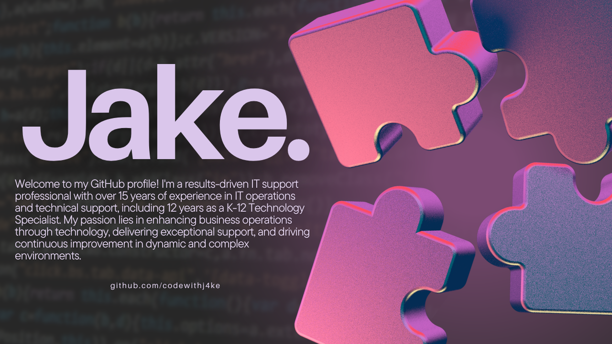

## Oi, World! I'm Jake 👋

I’m a dedicated tech enthusiast and professional with a passion for turning ideas into reality through fast, responsive, and accessible experiences. My journey into technology began in the '90s, inspired by my dad, a seasoned programmer, who introduced me to coding and gaming at a young age. My first dive into the tech world was playing Wolfenstein on his PC at age 5, and that moment sparked a lifelong fascination with technology. Since then, my love for the internet has fueled my drive to learn, create, and develop impactful websites and web applications.

Additionally, I'm currently diving into Python, eager to leverage AI capabilities for optimizing workflows and automating tasks.

## What I'm Working On
- 💡 Learning Python programming with the assistance of AI and online courses.
- 💡 Enhancing my Python skills to build impactful solutions in IT and education.
- 💡 Exploring AI to find innovative ways to improve workflow automation and data analysis.

## 📈 My GitHub Stats

Thanks for visiting my profile! Let's innovate and create impactful solutions together!

<!---
codewithj4ke/codewithj4ke is a ✨ special ✨ repository because its `README.md` (this file) appears on your GitHub profile.
You can click the Preview link to take a look at your changes.
--->
